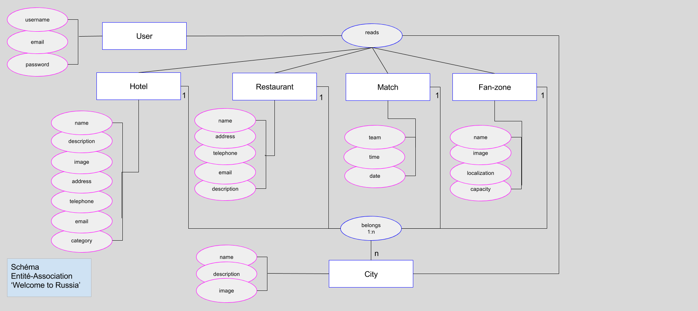

# Schema BD Welcome to Russia
En utilisant la méthodo MERISE

## Dico de données

On ne stockera pas en BD certains champs:
- STATIQUE = donnée qui ne va a priori pas changer pendant la durée de vie de l'application
- CALCULÉ = donnée qu'on peut retrouver à partir des autres données déjà stockées

*La colonne `nom` contient le nom du champ tel que stockable* c'est à dire qui respecte les conventions de nommage etc.
*La colonne description elle, contient une description plus compréhensible, qui ne laisse pas de doute sur ce qu'on stocke*

| entité | nom | description | type | commentaires |
|-----|-------------|------|--------------|--------|
|City|id|numéro de la ville|INT|AUTO_INCREMENT|
|City|name|nom de la ville|VARCHAR(255)||
|City|description | description de la ville | VARCHAR(255)||
|City|image | image de la ville | VARCHAR(255)||
|City&Hotel| | ville et hotels associés | |COMPOSE|
|City&Restaurant| | ville et restaurants associés | |COMPOSE|
|City&FanZone| | ville et fanzone associés | |COMPOSE|
|Hotel|id|numéro de l'hotel|INT|AUTO_INCREMENT|
|Hotel|name|nom de l'hotel|VARCHAR(180)||
|Hotel|description | description de l'hotel | VARCHAR(255)||
|Hotel|image | image de l'hotel  | VARCHAR(255)||
|Hotel|category|catégorie de l'hotel|VARCHAR(180)||
|Hotel|address|adresse de l'hotel|VARCHAR(180)||
|Hotel|telephone|téléphone de l'hotel|INT(50)||
|Hotel|email|email de l'hotel|VARCHAR(180)||
|Hotel&City| | hotels et ville associés | |COMPOSE|
|User|id|numéro de l'utilisateur|INT|AUTO_INCREMENT|
|User|username | pseudo | VARCHAR(180) | |
|User|  email | email | VARCHAR(180) | |
|User| password | password | VARCHAR(255) | |
|User|role|rôle de l'utilisateur| VARCHAR(50) |
|FanZone|id|numéro de la fan-zone|INT|AUTO_INCREMENT|
|FanZone|name | nom de la fan-zone | VARCHAR(255)||
|FanZone|image | image de la fan-zone | VARCHAR(255)||
|FanZone|localization | localisation de la fan-zone | VARCHAR(255)||
|FanZone|capacity | capacité de la fan-zone | INT(100)||
|FanZone&City| |  fan-zones et ville associés||COMPOSE|
|Match|id|numéro du match|INT|AUTO_INCREMENT|
|Match|date|date du match|DATE||
|Match|time|heure du match|TIME||
|Match|team|équipes du match|VARCHAR(100)||
|Match&City||matches et ville associés||COMPOSE|
|Restaurant|id|numéro du restaurant|INT|AUTO_INCREMENT|
|Restaurant|name | nom du restaurant | VARCHAR(180)||
|Restaurant|address|adresse du restaurant|VARCHAR(255)||
|Restaurant|telephone|téléphone du restaurant|INT(50)||
|Restaurant|email|email du restaurant|VARCHAR(255)||
|Restaurant|description|description du restaurant|VARCHAR(255)||
|Restaurant&City||restaurants et ville associés||COMPOSE|
|-----|-------------|------|--------------|--------|
|  | nom du site |  | STATIQUE                     |  |  
|  | nom de la page |  | STATIQUE                         |  |  
|  | text footer |  | STATIQUE                            |  |   
|  | confirmation password |  | CALCULÉ > récup/vérif PHP |  |  |

## Modèle Conceptuel de Données (Schema Entité/Association)

## Modèle Logique de Données (Schéma des tables)

1. Entités => Tables

+ users
  - __id__     INT | AUTO_INCREMENT
  - username     VARCHAR(180)
  - email    VARCHAR(180)
  - password     VARCHAR(255)
  - role    VARCHAR(50)

+ cities
  - __id__     INT | AUTO_INCREMENT
  - name     VARCHAR(255)
  - description    VARCHAR(255)
  - image     VARCHAR(255)

+ hotels
  - __id__     INT | AUTO_INCREMENT
  - name     VARCHAR(180)
  - description    VARCHAR(255)
  - image     VARCHAR(255)
  - category     VARCHAR(180)
  - address    VARCHAR(180)
  - telephone    VARCHAR(20)
  - email    VARCHAR(180)
  - #id_city   INT

+ fan_zones
  - __id__     INT | AUTO_INCREMENT
  - name     VARCHAR(255)
  - image    VARCHAR(255)
  - localization    VARCHAR(255)
  - capacity    INT(100)
  - #id_city   INT

+ matches
  - __id__     INT | AUTO_INCREMENT
  - date  DATE
  - time TIME
  - team VARCHAR(100)
  - #id_city   INT

+ restaurants
  - __id__     INT | AUTO_INCREMENT
  - name     VARCHAR(180)
  - address    VARCHAR(255)
  - telephone    VARCHAR(20)
  - email    VARCHAR(255)
  - description    VARCHAR(255)
  - #id_city   INT
